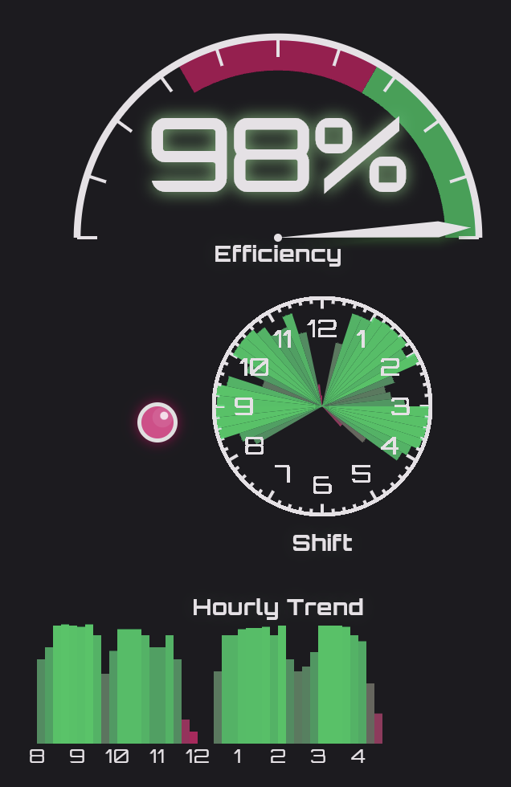
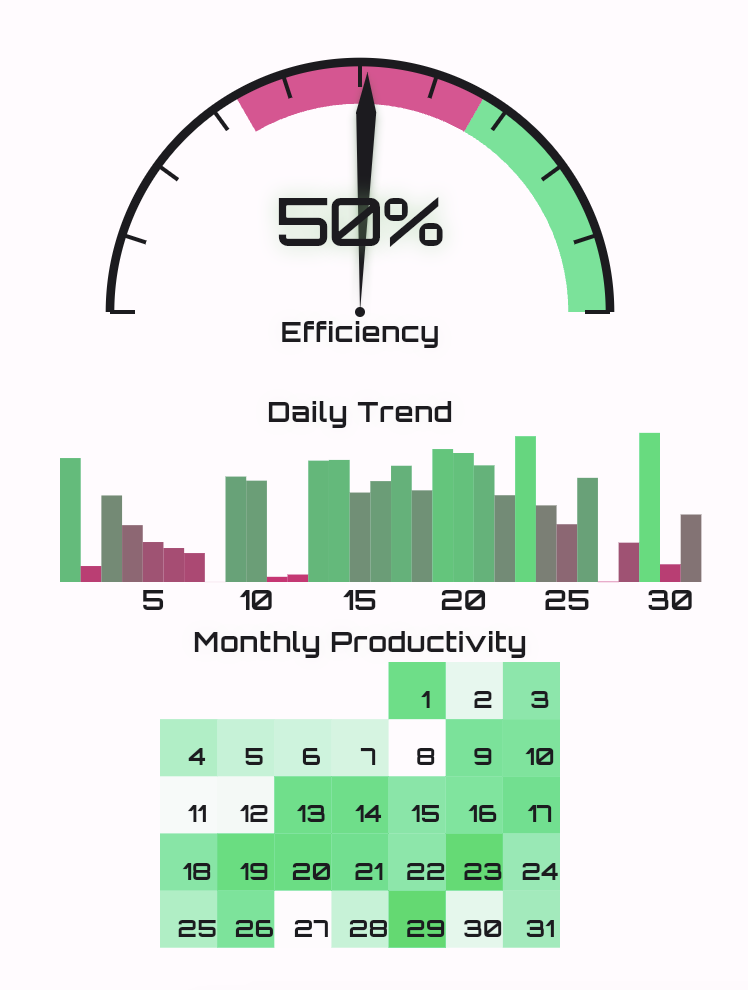

# visuals

Visual sandbox for Uptime application.

### Quickstart

```bash
utils/Quickstart.sh
```

## Examples

Day (dark mode)



Month (light mode)



### TODO

* Add grow-on-click to all visuals

* Fix text size on month chart

* Add financial visuals